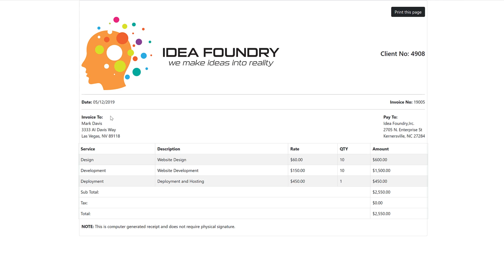
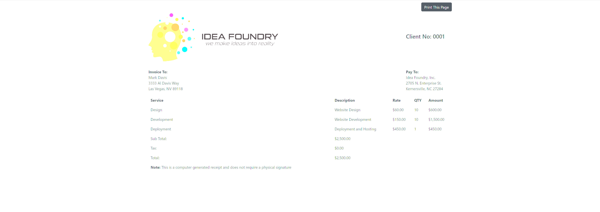

# CF-07.BootStrapInvoice

### *An invoice lab utlizing bootstrap's responsive tables and JavaScript's print to pdf functionality*<hr>

## Technologies Used:
- Shell and scripting language: Powershell
- Frontend: HTML5, CSS3, JavaScript, Bootstrap 5
<hr>

## Challenges
- Bootstrap Tables (add excel funcitonality?)
- Bootstrap Fonts
- Responsive scrolling
- Print to PDF using JavaScript   
<hr>

## Solution vs. Attempt


<hr>

## Getting Started
### Resources Used

IDE:
- <a href="https://code.visualstudio.com/">Visual Studio Code</a>
  
Version Control:
- <a href="https://desktop.github.com/">GitHub for Desktop</a>

Extensions
- <a href="https://marketplace.visualstudio.com/items?itemName=ritwickdey.LiveServer">Live Server</a>
- <a href="https://marketplace.visualstudio.com/items?itemName=vscode-icons-team.vscode-icons">VSCode-Icons</a>
- <a href="https://marketplace.visualstudio.com/items?itemName=CoderFoundry.bootstrap-5-snippets-by-coder-foundry">Bootstrap 5 Snippets</a>
- <a href="https://marketplace.visualstudio.com/items?itemName=HookyQR.beautify&ssr=false#overview">Beautify</a>
- <a href="https://marketplace.visualstudio.com/items?itemName=formulahendry.auto-rename-tag">Auto Rename Tag</a>
- <a href="https://marketplace.visualstudio.com/items?itemName=thekalinga.bootstrap4-vscode">Bootstrap 4, Font Awesome</a>
- <a href="https://marketplace.visualstudio.com/items?itemName=ms-dotnettools.csharp">C#-Microsoft</a>
- <a href="https://marketplace.visualstudio.com/items?itemName=pranaygp.vscode-css-peek">CSS Peek</a>
- <a href="https://marketplace.visualstudio.com/items?itemName=dbaeumer.vscode-eslint">ES Lint</a>
- <a href="https://marketplace.visualstudio.com/items?itemName=Zignd.html-css-class-completion">Intellisense for CSS</a>
- <a href="https://marketplace.visualstudio.com/items?itemName=xabikos.JavaScriptSnippets">Javascript (ES6) Snippets</a>
- <a href="https://marketplace.visualstudio.com/items?itemName=VisualStudioExptTeam.vscodeintellicode">Visual Studio Intellicode</a>
<hr>

## Building The Container

- Use the base bootstrap template
- Create a div element with a class of container, rounded, 2 units of padding, and a border with a weight of 2 pixels
<hr>

## Building The Button
- Create a div element with a class of display-grid, justified content at the end with a medium breakpoint, a top margin of 3 units, and a display print of none
  - Note: horizontal positions are justifications and vertical positions are alignments
  - The class d-print-none removes the button on the to be printed document
- Create a button element with a type of botton, class of button, button dark
- To add the printing functionality you'll add the following:
  ```js
  onclick="window.print()"
  ```
  - This JavaScript functionality is built into Bootstrap
-  the button text will be Print This Page
<hr> 

## Building the Invoice
- Create a div element with a class of row and align all items within it to the center
  - Rows inherently have the flexbox property and it's items are positioned vertically, Columns need the flexbox property and it's contents are positioned horizontally
- Within the row create two columns

### The Image Column
- The first column will be a 7 unit column with a small breakpoint, flexible display, content which is justified to the end follwing a small break point, and content which is justified to the start; *Note: the justified to the start class will occur on viewports larger than the small breakpoint*
  - The first column will house our image and will have a title and alt text of Idea Foundry Logo and a class of image-fluid; *Note: the image fluid class allows images to be responsive* 
  
### The Customer Column
- The second column will be a 5 unit column with a small break point, flexible display, and content which is justified to the start
- Using the strong semantic element and enter "Customer:"
- Next we'll use a non-breaking space:
  ```
  &nbsp;
  ```
  - Non-breaking spaces allow strings that are separated by it will not be separated and put into separate lines

### Invoice to and Pay to Row
- Create a div element with a class of row
- We'll be using a new element called row-cols-1; row-cols-1 stacks all the rows into one column at a certain breakpoint
- Finally give the row div eht class of row-cols-md-2; row-cols-md-2 divides the column into two rows until it hits the medium brekpoint

### "Invoice To" and "Pay To:" Columns
- Create a div element with a class of: column with six units, flexible display, and content which is justified at the start
- Create a wrapper div to house the Invoice To information
- using the strong semantic element add our "Invoice to:" and a breakpoint
- using the address semantic element with a class of address enter the address with a breakpoint after each address portion
  - The address semantic element should alwasy be used when entering in addresses
- Follow the same procedure for the "Pay To" Column
<hr>

## Building The Table
### The Table Row
- Create a dive element with the class of row
- We'll be using a new element called table-responsive; this allows the table to scroll horizontally on smaller devices
  
### Setting up the table
- All tables consist of three elements, table header (thead), table body(tbody), and table footer (tfoot)
  - table footers are not mandatory
- Create a table element with a class of table, table-striped, and table-bordered
- Within the table, create our three table elements
  
### Table Header
- Within header create a tr ,or table row, element
- Within the tr element, create four th, or table heading, elements
  - these will house our Table headings
- Create a final th element with a class of text-end; this is for our amount column
  - tables, like rows and columns, have a specifict way of changing content position; this is the text-end class

### Table Body
- Create a tr element
- within the tr element create four td, or table desctiption, elements
  - these will house our table descriptions
  - create the final td element with a class of text-en
  - follow this procedure for the development and deployment rows

### Table Footer
- Create a tr element
- Within the tr element create a td element with a colspan of 4, the text will be Subtotal
  - the colspan element allows a cell to take up multiple columns
- Create another td element with a class of text end, remembe this is for our amount column
- Repeat this for the tax and total rows
<hr>

## Adding our note
- Outside of the table, create a row div and within it create a 12 unit column div
- using the strong semantic element and a non-breaking space, create our note
<hr>

## Project References

- <a href="https://learn.coderfoundry.com/">Coder Foundry</a>
  
### Frontend

### Backend

### Cloud
  
### Other
  
<hr>

## License
<hr>